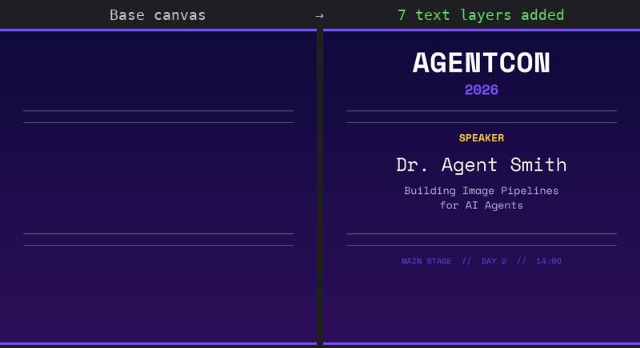
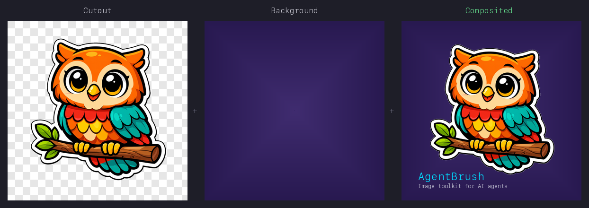
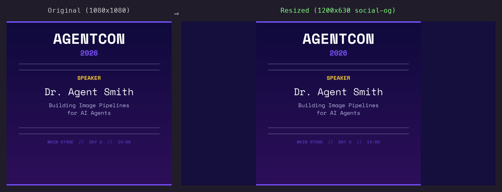

# AgentBrush

[](https://pypi.org/project/agentbrush/)
[](https://python.org)
[](LICENSE)
[](https://agentskills.io)
[](#testing)

Image editing toolkit for AI agents. Background removal, compositing, text rendering, resizing, format conversion, and spec validation.

## Install

```bash
pip install agentbrush
```

With AI image generation support:

```bash
pip install agentbrush[generate]
```

## Quick Start

### Python API

```python
from agentbrush import remove_background, resize_image, validate_design

# Remove background (edge-based flood fill, safe for artwork)
result = remove_background("photo.png", "cutout.png", color="white")

# Resize for social media
result = resize_image("cutout.png", "og_image.png", width=1200, height=630, pad=True)

# Validate against a preset
result = validate_design("og_image.png", preset="social-og")
print(result.summary())
```

Every function returns a `Result` object:

```python
result.success         # True if no errors
result.width           # Output width in px
result.height          # Output height in px
result.transparent_pct # Percentage of transparent pixels
result.warnings        # Non-fatal issues
result.errors          # Fatal issues
result.metadata        # Operation-specific data
result.summary()       # Human-readable string
```

### CLI

```bash
# Background removal
agentbrush remove-bg input.png output.png --color white --smooth

# Green screen removal
agentbrush greenscreen input.png output.png --upscale 3 --halo-passes 20

# Border artifact cleanup
agentbrush border-cleanup input.png output.png --passes 15 --green-halo-passes 20

# Text rendering
agentbrush text input.png output.png "HELLO" --font mono --bold --size 72
agentbrush text new:1200x630 output.png "Title Text" --bold --center

# Compositing
agentbrush composite base.png art.png output.png --position 100,200
agentbrush composite paste-centered output.png --overlay art.png --canvas 1200x630 --fit

# Resize
agentbrush resize input.png output.png --width 1200 --height 630
agentbrush resize input.png output.png --scale 3.0
agentbrush resize input.png output.png --width 1080 --height 1080 --fit --pad

# Validate against presets
agentbrush validate check image.png --preset social-og
agentbrush validate check image.png --preset favicon
agentbrush validate check image.png --width 800 --height 600 --transparent
agentbrush validate compare source.png processed.png --max-loss 10

# Format conversion
agentbrush convert input.png output.jpg --quality 95
agentbrush convert input.png output.webp --quality 90

# AI image generation (requires openai package)
agentbrush generate --provider openai --prompt "cat coding" --output cat.png
```

Exit codes: `0` = success, `1` = validation failure, `2` = input error.

## Examples

### Background Removal

Edge-based flood fill removes the background while preserving artwork that threshold-based tools destroy. The colorful owl below keeps every feather edge, outline, and sticker border intact — only the solid white background is removed:


```bash
agentbrush remove-bg owl.png cutout.png --color white --smooth
```

### Green Screen Removal

Multi-pass pipeline handles fine fur, hair, and complex outlines. The arctic fox below has thousands of wispy fur strands at the boundary — flood fill + trapped patch sweep + 3× upscale + halo cleanup preserves them all:


```bash
agentbrush greenscreen fox.png cutout.png --upscale 3 --halo-passes 25
agentbrush border-cleanup cutout.png clean.png --green-halo-passes 25 --alpha-smooth
```

### Text Rendering

Accurate Pillow-based text rendering — layer multiple text elements with different sizes, colors, and positions. No AI text mangling, every character pixel-perfect:



```bash
agentbrush text badge_bg.png step1.png "AGENTCON" --font mono --bold --size 96 --center
agentbrush text step1.png step2.png "2026" --font mono --bold --size 48 --color "120,80,255,255" --center
agentbrush text step2.png step3.png "SPEAKER" --font mono --bold --size 36 --color "255,200,50,255" --center
agentbrush text step3.png final.png "Dr. Agent Smith" --font mono --size 64 --center
```

### Compositing

Combine cutouts, backgrounds, and text into finished assets. The owl cutout from step 1 is placed on a gradient background with text overlay — a complete workflow in three commands:



```bash
agentbrush composite gradient.png owl_cutout.png composed.png --position center --resize 500x500
agentbrush text composed.png final.png "AgentBrush" --font mono --bold --size 48 --color "0,220,255,255"
```

### Resize & Validate

Resize to exact dimensions with letterbox padding, then validate against platform presets. Square badge → OG image in one command:



```bash
agentbrush resize badge.png og_image.png --width 1200 --height 630 --fit --pad --pad-color "20,15,60,255"
agentbrush validate check og_image.png --preset social-og
# [OK] Size: 1200x630px — preset: social-og ✓
```

## Agent Skills

AgentBrush ships as an [Agent Skills](https://agentskills.io) package. Copy `skill/agent-brush/` into your project's `.claude/skills/` directory:

```bash
cp -r skill/agent-brush/ .claude/skills/agent-brush/
```

Claude Code (and other compatible tools) will automatically discover the skill and use it when processing images.

## Usage Without Install

The standalone scripts work directly from a git clone — no `pip install` needed:

```bash
git clone https://github.com/ultrathink-art/agentbrush.git
cd agentbrush

python skill/agent-brush/scripts/remove_bg.py input.png output.png --color black
python skill/agent-brush/scripts/validate.py check image.png --preset social-og
python skill/agent-brush/scripts/resize.py input.png output.png --width 1200 --height 630
```

Requirements: **Python >= 3.10** and **Pillow >= 12.1** (`pip install 'Pillow>=12.1'`).

## Modules

| Module | Description | Key function |
|--------|-------------|-------------|
| `background` | Edge-based flood fill bg removal | `remove_background()` |
| `greenscreen` | Multi-pass green screen pipeline | `remove_greenscreen()` |
| `border` | Border artifact erosion + halo cleanup | `cleanup_border()` |
| `text` | Pillow text rendering (accurate) | `add_text()`, `render_text()` |
| `composite` | Image layering + centering | `composite()`, `paste_centered()` |
| `resize` | Resize with fit/pad/scale modes | `resize_image()` |
| `validate` | Spec validation against presets | `validate_design()`, `compare_images()` |
| `convert` | Format conversion (PNG/JPEG/WEBP) | `convert_image()` |
| `generate` | AI image generation (optional) | `generate_image()` |

## Core Primitives

Low-level functions available for custom pipelines:

```python
from agentbrush.core import (
    flood_fill_from_edges,   # BFS flood fill (4-conn or 8-conn)
    is_near_color,           # Color distance matching
    parse_color,             # Parse "black", "white", "R,G,B" strings
    smooth_edges,            # 1px edge feathering
    smooth_alpha_edges,      # Gaussian alpha blur (edges only)
    find_artwork_bounds,     # Opaque pixel bounding box
    crop_to_content,         # Crop to content with padding
    find_opaque_centroid,    # Center of mass for opaque region
    ensure_single_shape,     # Remove floating elements (8-connected BFS)
    count_components,        # Connected component count
    find_font,               # Cross-platform font discovery
)
```

## Presets

### General Purpose

| Preset | Width | Height | Transparent | Use Case |
|--------|-------|--------|-------------|----------|
| `social-og` | 1200 | 630 | No | Open Graph / link previews |
| `social-square` | 1080 | 1080 | No | Instagram, social posts |
| `social-story` | 1080 | 1920 | No | Stories, reels, vertical |
| `favicon` | 32 | 32 | Yes | Browser favicon |
| `icon-ios` | 1024 | 1024 | No | iOS app icon |
| `icon-android` | 512 | 512 | Yes | Android app icon |
| `thumbnail` | 400 | 400 | - | Thumbnails, previews |
| `banner` | 1920 | 480 | - | Website/profile banners |
| `avatar` | 256 | 256 | No | Profile avatars |

### Custom & Domain-Specific

Define custom specs inline or use domain-specific presets (e.g., print-on-demand). See [docs/presets/](docs/presets/) for additional preset packs.

## Why Edge-Based Flood Fill?

Threshold-based removal (`magick -fuzz -transparent black`) scans every pixel and removes anything "close enough" to the target color — including internal outlines, dark shadows, and fine details inside the artwork.

AgentBrush starts flood fill from image edges only. Interior pixels that happen to match the background color are never touched because flood fill can't reach them without crossing through the artwork.

```
Threshold-based:              Edge-based flood fill:
removes ALL dark pixels       removes ONLY edge-connected dark pixels
+-----------------+           +-----------------+
|                 |           |                 |
|    #########    |           |    #########    |
|   #         #   | <- loses  |   #*********#   | <- preserved!
|   #         #   |   detail  |   #*********#   |
|    #########    |           |    #########    |
|                 |           |                 |
+-----------------+           +-----------------+
```

## Guides

Step-by-step pipeline walkthroughs:

- [Social Media Images](docs/examples/social_media_images.md) — OG images, thumbnails, avatars
- [Background Removal](docs/examples/background_removal.md) — black bg, white bg, green screen techniques

## Testing

```bash
pip install -e ".[dev]"
pytest tests/ -v
```

All tests use synthetic Pillow-generated fixtures (no production images).

## Dependencies

- **Required**: `Pillow >= 12.1`
- **Optional**: `openai >= 1.0` (for `generate` command)
- **Dev**: `pytest >= 7.0`, `pytest-cov`

## License

MIT
